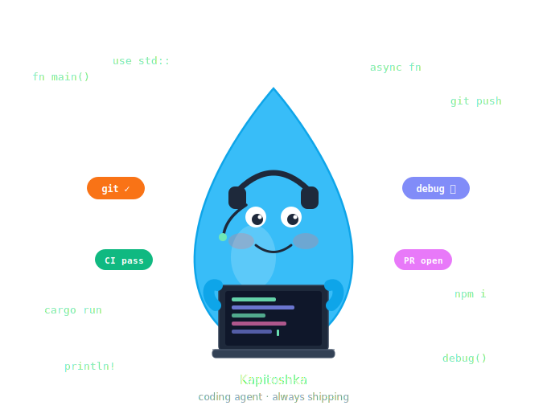

# Kapitoshka

> 

A coding agent built in Rust. It connects to any OpenAI-compatible inference server, reasons about your codebase, and uses tools to read files, write files, list directories, and run shell commands.

## Requirements

- An OpenAI-compatible inference server (OpenAI, Ollama, vLLM, LM Studio, llama.cpp, etc.)
- Or Anthropic-compatible inference server.

## Setup

```bash
export OPENAI_API_KEY=your-key          # required (use any string for local servers)
export OPENAI_BASE_URL=http://127.0.0.1:8080/v1  # omit to use OpenAI directly
```

## Usage

```bash
cargo run -- --dir /path/to/project --model my-model
```

### Options

| Flag | Short | Default | Description |
| ------ | ------- | --------- | ------------- |
| `--dir` | `-d` | `.` | Working directory (root for all file operations) |
| `--provider` | `-p` | `openai` | Model provider |
| `--model` | `-m` | `Qwen3-0.6B` | Model name to use |
| `--thinking` | | off | Display the model's internal reasoning (requires model support) |
| `--context-size` | | `0` | Context window size in tokens — enables fill-% display and automatic compaction |
| `--resume` | | — | Path to a `.json` session state file to restore history from a previous session |

### Context management

Kapitoshka tracks context window usage and manages history automatically.

**Usage stats** are printed after every response:

```text
  ctx  in:4820  out:312  total:5132  37% of 131k
```

The percentage requires `--context-size` to be set to your model's context window (e.g. `131072`).

**Automatic compaction** fires when context fill reaches 75% (or 80 000 tokens if `--context-size` is not set). It:

1. **Summarises** the middle section of history by asking the model to produce a concise bullet-point summary of files touched, commands run, and decisions made.
2. **Keeps** the first turn (task context) and the last 8 messages (recent work) intact — only the middle is replaced.
3. **Compresses** tool results older than the last 8 messages to 400 characters, recovering the bulk of context consumed by large file reads.
4. **Injects the summary** as working memory into every subsequent request so the model retains context across compaction boundaries.

When compaction runs you will see:

```text
✂  compacting context…
  ctx  in:…  out:…  total:…  ✂ history compacted
```

### Session resilience

Kapitoshka saves conversation state (history + compaction scratchpad) to a JSON sidecar file next to the session log after every successful turn. If the process crashes or is killed, at most one turn of context is lost.

To resume a previous session:

```bash
kapitoshka --resume ~/.kapitoshka/sessions/2024-01-15-143022.json --dir /path/to/project --model my-model
```

Pressing **Ctrl+C** during a running turn cancels that turn and returns to the prompt without exiting.

## Project Rules (AGENTS.md)

Kapitoshka reads an `AGENTS.md` file from the working directory (`--dir`) at startup and injects its contents into the system prompt.

Create `AGENTS.md` in the root of your project to give the agent persistent, project-specific instructions — coding conventions, test commands, off-limits paths, preferred patterns, etc.

### Global rules

Any content before the first agent-specific heading is treated as global rules and always included:

```markdown
Always run `cargo clippy` before reporting a task complete.
Never edit files inside `vendor/`.
Prefer `patch_file` over `write_file` for small edits.
```

### Agent-specific sections

Use a `#` or `##` heading whose text matches the agent name (`kapitoshka`, case-insensitive) to write rules that apply only to this agent. Rules for other agents are silently ignored.

```markdown
# Shared rules (applied to every agent)

Run the test suite with `cargo test` after every change.

## kapitoshka

Use conventional commits (feat:, fix:, chore:, …).
Do not modify `Cargo.lock` directly.

## some-other-agent
Rules here are ignored by kapitoshka.
```

Sub-headings (`###` and deeper) inside an agent section are preserved as part of that section's body, so you can structure rules however you like.

## Tools

| Tool | Description |
| ------ | ------------- |
| `read_file` | Read a file, optionally limited to a line range (`start_line`, `end_line`) to avoid flooding the context window |
| `write_file` | Write content to a file (creates missing directories). Full overwrite — prefer `patch_file` for edits |
| `patch_file` | Replace an exact string in a file with new content. Errors if the match is ambiguous or missing |
| `list_dir` | List directory contents |
| `search_file` | Search for a literal string in a file and return matching lines with line numbers |
| `run_shell` | Run a shell command (e.g. `cargo test`, `grep -r foo src/`). Destructive commands are blocked |

All file paths are resolved relative to `--dir`.

### Shell safety

`run_shell` enforces a blocklist before executing any command. The following are blocked unconditionally:

| Category | Examples |
| --------- | -------- |
| Filesystem destruction | `rm -rf /`, `mkfs`, `dd if=`, `> /dev/sda` |
| Privilege escalation | `sudo`, `su -`, `pkexec` |
| Outbound network | `curl`, `wget`, `ssh`, `scp`, `rsync`, `nc` |
| Irreversible git | `git push` (any form) |
| Resource exhaustion | fork bombs |
| Shell escapes | `eval`, `exec` |

Safe commands such as `cargo test`, `git status`, `grep`, and `rm -rf target/` pass through unaffected.

## Trajectory Collection

Kapitoshka records every agent turn as a structured JSON trace alongside the session log. This is useful for offline analysis, fine-tuning dataset construction, latency profiling, and failure inspection.

### Output format

Each session produces a `.jsonl` sidecar file (one JSON object per line, one line per turn):

```text
~/.kapitoshka/sessions/2026-05-30-120000.md      ← human-readable session log
~/.kapitoshka/sessions/2026-05-30-120000.jsonl   ← trajectory records
```

Each record captures the complete causal chain for a turn:

```json
{
  "turn": 1,
  "timestamp": "2026-05-30T12:00:01.234Z",
  "user": "add a test for the parser",
  "total_duration_ms": 4821,
  "spans": [
    { "type": "thinking",   "text": "I need to locate the parser module first…" },
    { "type": "tool_call",  "id": "c1", "name": "read_file", "input": { "path": "src/parser.rs" } },
    { "type": "tool_result","call_id": "c1", "output": "pub fn parse(…) {…}", "duration_ms": 12 },
    { "type": "tool_call",  "id": "c2", "name": "patch_file", "input": { "path": "src/parser.rs", "old": "…", "new": "…" } },
    { "type": "tool_result","call_id": "c2", "output": "ok", "duration_ms": 8 },
    { "type": "response",   "text": "Added `test_parse_empty`.", "input_tokens": 3210, "output_tokens": 48, "cached_tokens": 2800, "reasoning_tokens": 120 }
  ]
}
```

### Span types

| Span | Fields | Description |
| ---- | ------ | ----------- |
| `thinking` | `text` | Internal reasoning emitted before the response (only present when the model produces it) |
| `tool_call` | `id`, `name`, `input` | Tool invoked by the model; `input` is the JSON arguments |
| `tool_result` | `call_id`, `output`, `duration_ms` | Result returned to the model; `call_id` matches the originating `tool_call` |
| `response` | `text`, `input_tokens`, `output_tokens`, `cached_tokens`, `reasoning_tokens` | Final assistant reply with per-turn token breakdown |

### Querying with `jq`

```bash
# Average turn duration across a session
jq '.total_duration_ms' session.jsonl | awk '{s+=$1;n++} END{print s/n "ms avg"}'

# List every tool called in order
jq '[.spans[] | select(.type=="tool_call") | .name]' session.jsonl

# Find turns where a specific tool was used
jq 'select(.spans[].name? == "run_shell") | .user' session.jsonl

# Token efficiency: cached ratio per turn
jq '{turn, ratio: (.spans[-1].cached_tokens / .spans[-1].input_tokens)}' session.jsonl
```

## Tracing & Observability

Kapitoshka writes structured logs to `~/.kapitoshka/` after every session:

| File | Format | Use |
| ---- | ------ | --- |
| `trace.log.<date>` | Human-readable text (daily rolling) | Local debugging |
| `trace.json.<date>` | Newline-delimited JSON (daily rolling) | Ingest into Loki, Datadog, `jq`, etc. |

### OpenTelemetry (OTLP)

Set `OTEL_EXPORTER_OTLP_ENDPOINT` to export spans to any OTel-compatible backend (Jaeger, Tempo, Honeycomb, …):

```bash
export OTEL_EXPORTER_OTLP_ENDPOINT=http://localhost:4317
export OTEL_SERVICE_NAME=kapitoshka   # optional, defaults to "kapitoshka"
kapitoshka --dir /path/to/project --model my-model
```

Spans emitted per session:

| Span | Attributes |
| ---- | ---------- |
| `session` | `id`, `dir`, `model` |
| `turn` | `history_len`, `input_tokens` |

When `OTEL_EXPORTER_OTLP_ENDPOINT` is not set the OTel layer is not initialised and adds zero overhead.

## License

See [LICENSE](LICENSE) for details.

## Acknowledgments

- Built on [rig](https://github.com/0xPlaygrounds/rig).
